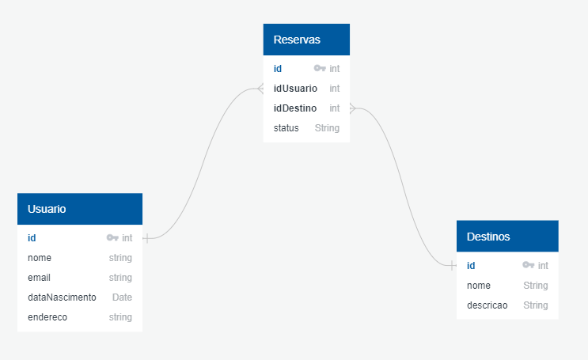

# Criando um banco de dados usando o MySQL Workbench


Enunciado: Exemplos básicos de criação de um banco de dados, criação de tabelas, inserção de dados e consultas simples. O intuito aqui é exercitar os conceitos básicos passados no curso de Introdução a Banco de Dados Relacionais (SQL) da plataforma DIO. A tabelas criadas foram elaboradas a partir do modelo relacional abaixo:

<div align="center">

</div>


## Criando as tabelas

### Criar um banco de dados chamado "viagens"

```mysql

CREATE DATABASE viagens;

```

### Selecione o banco de dados a ser manipulado

```mysql

USE viagens;

```

### Crie uma tabela chamada "usuario"

```mysql

CREATE TABLE IF NOT EXISTS usuario(
    id INT,
    nome VARCHAR(40) NOT NULL COMMENT 'Nome do usuário',
    email VARCHAR(30) NOT NULL UNIQUE COMMENT 'Endereço de e-mail do usuário',
    data_nascimento DATE NOT NULL COMMENT 'Data de nascimento do usuário',
    endereco varchar(50) NOT NULL COMMENT 'Endereço do usuário'
);


```

### Crie uma tabela chamada "destinos"

```mysql

CREATE TABLE IF NOT EXISTS destinos(
    id INT,
    nome VARCHAR(40) NOT NULL UNIQUE COMMENT 'Nome do destino',
    descricao VARCHAR(255) NOT NULL COMMENT 'Descrição do destino'
);

```

### Crie uma tabela chamada "reservas"

```mysql

CREATE TABLE IF NOT EXISTS reservas(
    id INT COMMENT 'Identificador unico de reserva',
    id_usuario INT COMMENT 'Referência ao ID do usuário que realizou a reserva',
    id_destino INT COMMENT 'Referencia ao ID do destino da reserva',
    data DATE COMMENT 'Data da reserva',
    status VARCHAR(20) DEFAULT 'pendente' COMMENT 'Status da reserva (confirmada, pendente, cancelada, analise)' 
);

```

## Inserindo e consultando dados

### Inserindo usuários dentro da tabela "usuario"

```mysql

INSERT INTO usuario (id, nome, email, data_nascimento, endereco) 
VALUES (1, "Rodrigo Duarte", "email@email.com", "2000-08-06", "Rua numero um, 15, Rio de Janeiro");

INSERT INTO usuario (id, nome, email, data_nascimento, endereco) 
VALUES (2, "Samira Silva", "samira@email.com", "2011-02-12", "Rua numero dois, 6, São Paulo");

INSERT INTO usuario (id, nome, email, data_nascimento, endereco) 
VALUES (3, "Belinha Jonas", "belinha@email.com", "2018-05-02", "Rua numero Tres, 98, Minas Gerais");

```

### Consultando valores na tabela
### Comando -> SELECT * FROM <nome_da_tabela>; -> Listará todos os dados da tabela "nome_da_tabela"

```mysql

SELECT * FROM usuario;

```

### Consultar apenas os usuários com a id = 1

```mysql

SELECT * FROM usuario WHERE id = 1;

```

### Consultar os usuarios com a id = 2 e que seu primeiro nome seja "Samira"

```mysql

SELECT * FROM usuario WHERE id = 2 AND nome LIKE "Samira%";

```

### Consultar os usuarios que tenham a id = 3  e seu sobrenome seja "Jonas"

```mysql

SELECT * FROM usuario WHERE id = 3  AND nome LIKE "%Jonas%";

```

### Inserindo e consultando dados na tabela "destinos"

```mysql

INSERT INTO destinos (id, nome, descricao) VALUE (1, "Ponta Negra", "Localizado em Natal - RN");
INSERT INTO destinos (id, nome, descricao) VALUE (2, "Cristo Redentor", "Localizado em Rio de Janeiro - RJ");
INSERT INTO destinos (id, nome, descricao) VALUE (3, "Praia de Ipanema", "Localizado em Rio de Janeiro - RJ");

SELECT * FROM destinos;

```

### Inserindo e consultando dados na tabela "reservas"

```mysql

INSERT INTO reservas (id, id_usuario, id_destino, data, status) VALUE (1, 1, 1, "2024-10-04", "análise");
INSERT INTO reservas (id, id_usuario, id_destino, data, status) VALUE (2, 2, 2, "2024-10-04", "confirmada");
INSERT INTO reservas (id, id_usuario, id_destino, data, status) VALUE (3, 3, 3, "2024-10-04", "cancelada");

SELECT * FROM reservas;

```

### Autor: Rodrigo Duarte

| [Linkedin](https://www.linkedin.com/in/rodrigoduar-te/) | [GitHub](https://github.com/rodrigoduartesilva/) | [Link do Repositório](https://github.com/rodrigoduartesilva/exemplos-banco-de-dados-mysql) |
